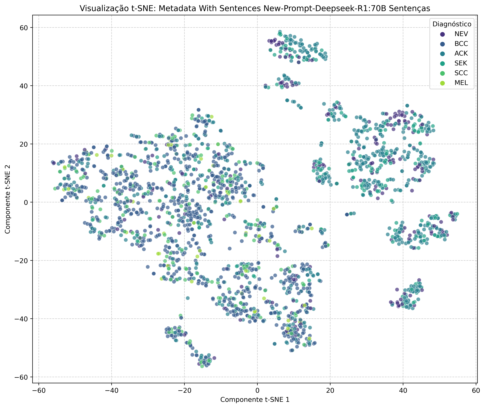
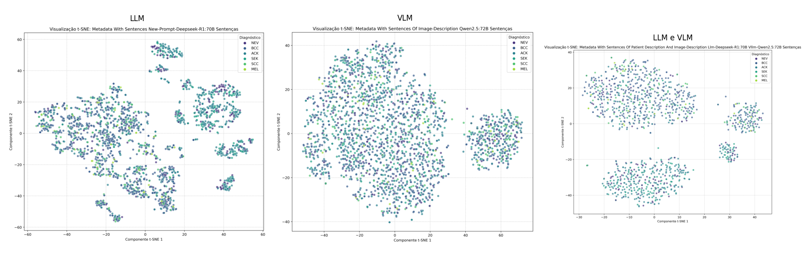

# TSNE USAGE TO COMPARE THE IMPACT OF IMAGE DESCRIPTION ON SKIN LESION RECOGNITION
## An Analysis with the PAD-UFES-20 Dataset

We've used the dataset PAD-UFES-20 to explore the impact of image description on the skin lesion recognition.

---
# Create enviroment:
```bash
    conda create -n eda-sentences
```
# To activate this environment, use
```bash
    conda activate eda-sentences
```
# Install libraries
To install the necessary libraries just write:

```bash
    pip3 install -r requirements.txt
```

# Run TSNE script
Add your csv file on the data folder and then run the script below:

```bash
    python3 src/scripts/tsne_of_sentences.py
```


It'll generate an image which contain 1 plot about: llm, vlm, or llm and vlm together.



# Join Different Images for Comparison

This script automatically combines the t-SNE projections of different sentence combinations (LLM, VLM, and LLM+VLM) into a single image.

```bash
    python3 src/scripts/join_images.py
```

It'll generate a jointed image which contains 3 subplots about: llm, vlm,and llm and vlm together, respectivelly.


# To deactivate an active environment, use
```bash
    conda deactivate
```